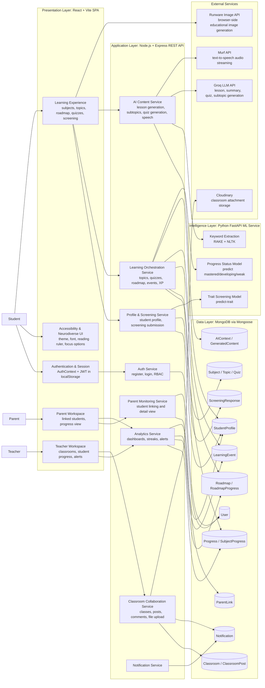

# Adaptive Learning Platform Architecture

## Recommended Figure Caption

Figure X. High-level architecture of the AI-powered adaptive learning platform for neurodiverse learners.

## Architecture Style

The system follows a layered web architecture with service-oriented augmentation:

- Presentation layer: React single-page application for students, teachers, and parents.
- Application layer: Node.js/Express REST API implementing authentication, personalization, adaptive learning, analytics, classrooms, parent monitoring, and notifications.
- Intelligence layer: Python FastAPI microservice for learner screening and progress-status prediction, plus external generative AI services.
- Data layer: MongoDB collections for users, learner profiles, progress, roadmaps, AI context, classrooms, notifications, and screening results.

## Research-Paper-Ready Diagram

## Architectural Interpretation

1. The frontend is a role-aware single-page application used by three stakeholders: students, teachers, and parents.
2. The Node.js backend is the system core. It exposes REST endpoints, enforces JWT-based access control, orchestrates learning workflows, stores state in MongoDB, and brokers calls to AI and ML services.
3. The Python ML microservice is separated from the main API because predictive functions are model-driven and use a different technology stack from the transactional backend.
4. Adaptive behavior is implemented through a combination of learner profile data, quiz/performance telemetry, roadmap progression, learning-event tracking, and AI-generated lesson content.
5. External AI services are used selectively:
   - Groq generates text-based instructional content and quizzes.
   - Murf generates speech/audio output.
   - Runware is invoked directly from the browser for visual learning assets.
   - Cloudinary stores classroom attachments when configured.

## Core Architectural Flow

1. A user authenticates through the React client, which stores a JWT and sends it on subsequent API calls.
2. Students complete screening and learning activities through the frontend.
3. The backend persists user, profile, curriculum, progress, roadmap, and event data in MongoDB.
4. For adaptive decisions, the backend calls the FastAPI ML service for trait screening and progress-status prediction.
5. For AI-generated pedagogy, the backend calls Groq to create lessons, summaries, subtopics, and quizzes, then optionally calls Murf for narration.
6. The frontend may directly request educational images from Runware using prompts returned by the backend.
7. Teachers and parents consume analytics generated from stored progress and activity data.

## Paper Notes

- If you need a cleaner publication figure, export the Mermaid diagram to SVG and place the caption above or below it.
- If your supervisor prefers a stricter software-engineering label, describe this as a "layered microservice-assisted adaptive learning architecture".
- If you want, this diagram can be converted next into:
  - a deployment diagram,
  - a C4 container diagram,
  - or a black-and-white thesis figure version.
